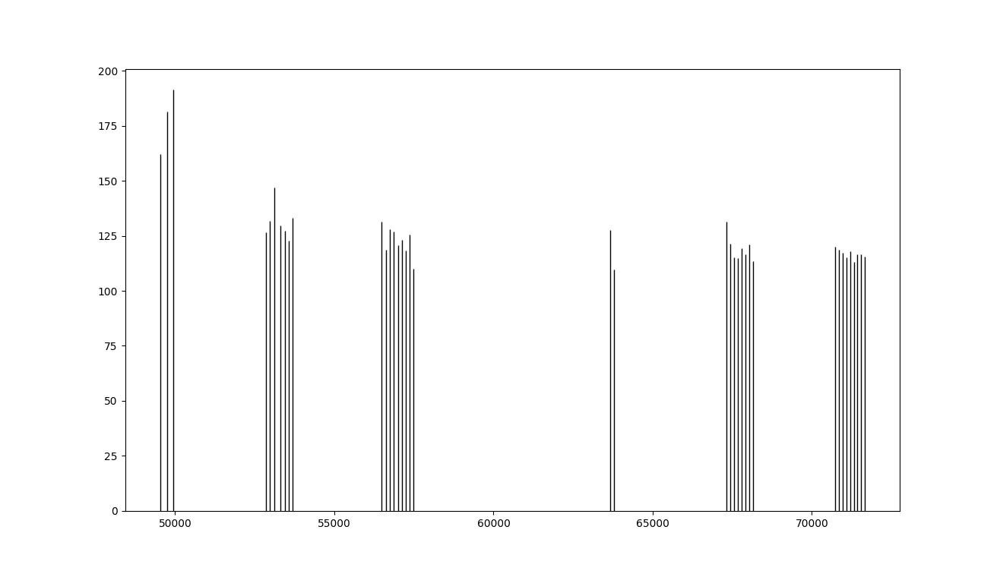

# D-Air Race Lap Times

This is a C++ program to calculate lap times from data produced by D-Air racing leathers.

## General Info
This is a personal project that I undertook to get some practice with C++ and to see if it was possible to calculate lap times from the data that is retrieved from the leathers, as the provided software does not calculate them (at least not that I have been able to find.)

As a personal project it is designed for my use, not the general public, or even the average user of D-Air racing leathers. It is run from the command line, has no user interface (other than the occasional graph) and has to be configured to work with a given track. (I have included the data required for the two tracks that I frequent - Shannonville Motorsport Park in Shannonville Ontario and Canadian Tire Motorsport Park (formerly Mosport) in Bowmanville Ontario.) It includes other potentially useful functionality, but it can only be accessed by commenting out some lines in the source code, uncommenting others and recompiling. Thus, familiarity with C++ is required to get the most out of it.

The program uses GPS coordinates to identify when the rider enters the track, exits the track and passes the start/finish line. The measured coordinates don't have to exactly match the target points to be recognized, but the "wiggle room" is fairly small - if it were any larger it would be possible to accidentally trigger an event, for example, a track entrance, when just riding by on the track.

It calculates the lap times using the time saved alongside each latitude/longitude measurement. Since these measurements occur at 6.25 Hz, the lap time's precision is 1s/6.25 = 0.16s. That is, it's not terribly precise, but it works for my goal of getting an idea of what my times are.

When the standard, Dainese-supplied software is used to download data from the suit, you control the directory that it is saved in. I like to save each download in a separate directory, but even if your downloads are all in one directory, the software will give all the files from a given download a unique base filename. Note that one download contains all the information saved in the suit since the last download, so it may contain more than one track day, or even data from more than one track.

My program lets you specify the directory to read data from as a command line argument. The base filename of the set to work with is stored in config.txt.

## Getting Started - Basic Usage
- Install Python 3.10, for example by using the instructions at https://realpython.com/installing-python/. The version must be 3.10, and it must be included in your path. Even though this program is written in C++, it uses matPlotLib for graphing, which is a Python library.
- Install matPlotLib. Sample instructions are available at https://matplotlib.org/stable/users/installing/index.html.
- Set up this program. Copy laptime.exe and fileRead.lib from build\DaineseSrc\Release to a directory on your computer. Copy run.bat and config.txt from the root of this repo to the same directory on your computer.
- Copy the data to analyze. (It's always best to work with a copy of the data rather than the originals!) Create a subdirectory under the directory that you put the program files in and copy in all the files from a download from your leathers. I'm not sure what the default directory for these downloads is - for me it was C:\RaceData. While you control exactly where the files for a download are saved, the program will usually create a unique subdirectory for each download. A full set of files has extensions like A0D, A0E, A0F, C00, C01, C0A, etc. Once you find a directory with these files, copy everything from it to the subdirectory you created under the program files.
- Edit run.bat to replace "Shann_2020_09_02" with the name of the subdirectory that you created which contains the data that you want to analyze.
- Open config.txt and change the baseFileName entry to match the first part of the names of the data files that you are working with - everything except the period and the extension. 
- Configure for the track. If you happen to be working with data from Mosport, the config should be ready to use - skip to the next step. If you are working with Shannonville long track info, put # symbols in front of all the lines in the Mosport section of config.txt and remove the # symbols from the corresponding Shannonville long track sections. (The long track data should also work with the Pro track or Nelson layouts, but hasn't been tested.) If you are working with another track, see the "Advanced Usage" section.
- Run the program. From a command prompt, in the directory containing the program files, run "run.bat". You should get a bunch of numbers, followed by a section labelled "Calculated lap times:" and then a graph of those times.

Each lap time entry contains a date (not including the year), the time of day (UTC, not local) and the lap time. The output includes in and out laps.

As noted above, it is possible to miss a trigger point, by being slightly outside the expected window for that point. You can adjust the GPS points for the various events in config.txt, along with the size of the window (latLongWindow entry), but it can be difficult to get a combination that correctly matches all the desired triggers without also generating some false positives.

In my experience there are occasionally abnormally long lap times. There is a setting in config.txt (lapTimeGraphCutoffMultiple) that lets you exclude from the graph lap times that are greater than that multiple of your average lap time. I.e. if your average time is 60s and the setting is 1.5, any lap over 1.5 * 60s = 90s will be excluded from the graph. This allows the differences among the remaining laps to be more easily seen.

### Mosport Lap Times

## Advanced Usage
See Advanced.md.

### Prerequisites

Python 3.10 (tested with 3.10.2.)
MatPlotLib (tested with 3.5.1, under Windows 10 pro and Windows 11 pro.)

## Authors

* **Greg Walker** - *Initial work* - (https://github.com/gregw18)

## License

MIT
